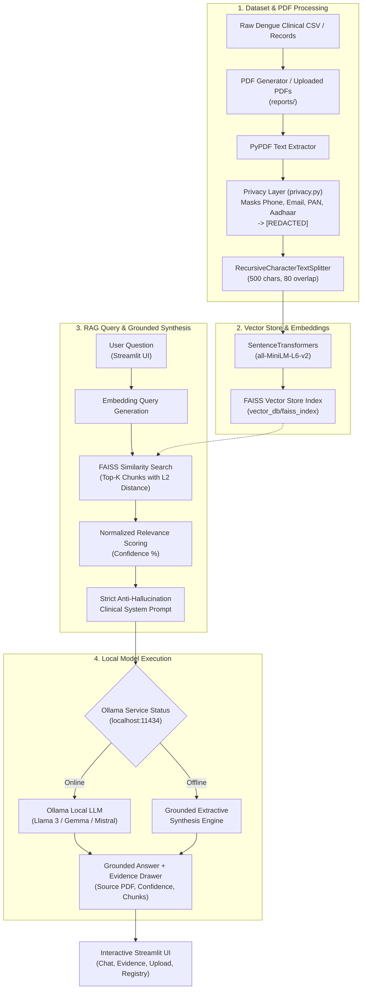

# 🦟 Multimodal Dengue Report RAG Assistant

[](https://www.python.org/)
[](https://streamlit.io/)
[](https://www.langchain.com/)
[](https://github.com/facebookresearch/faiss)
[](https://ollama.com/)
[](#7-privacy-layer-pii-redaction)

An enterprise-grade, offline-capable Healthcare Retrieval-Augmented Generation (RAG) assistant designed for analyzing synthetic dengue patient hematology reports, Complete Blood Count (CBC) profiles, NS1/IgM/IgG serology, and clinical triage classifications.

Runs completely **100% locally and offline** using **FAISS vector database**, **SentenceTransformers**, and **Ollama** (Llama 3, Gemma, Mistral), protected by a healthcare **Privacy Layer** that scrubs Personally Identifiable Information (Phone Numbers, Email Addresses, PAN Cards, Aadhaar IDs).

---

## 📑 Table of Contents
1. [Architecture Overview](#-architecture-overview)
2. [Key Features](#-key-features)
3. [Project Structure](#-project-structure)
4. [Installation & Setup](#-installation--setup)
5. [Ollama Local LLM Setup](#-ollama-local-llm-setup)
6. [Running the Application](#-running-the-application)
7. [Privacy Layer (PII Redaction)](#-privacy-layer-pii-redaction)
8. [Evidence Display & Anti-Hallucination](#-evidence-display--anti-hallucination)
9. [Sample Inquiries & Grounded Answers](#-sample-inquiries--grounded-answers)
10. [Sample Screenshots Description](#-sample-screenshots-description)

---

## 🏛️ Architecture Overview

The assistant processes clinical dengue reports through a modular, zero-leakage offline pipeline:



---

## ✨ Key Features

- **Local & Offline Execution**: Zero external cloud API dependencies. Runs on local CPU/GPU using FAISS and Ollama.
- **Multimodal PDF Ingestion**: Ingests multi-page clinical lab PDFs with structured tables, serological findings (Dengue NS1, IgM, IgG), and CBC hematology panels.
- **Healthcare Privacy Layer**: Automatic regex masking of sensitive Indian and international identifiers:
  - Phone Numbers (e.g. `+91 98765 43210` $\rightarrow$ `[REDACTED]`)
  - Email Addresses (e.g. `patient@medcare.org` $\rightarrow$ `[REDACTED]`)
  - PAN Numbers (e.g. `ABCDE1234F` $\rightarrow$ `[REDACTED]`)
  - Aadhaar Numbers (e.g. `8074 5506 5012` $\rightarrow$ `[REDACTED]`)
- **Semantic FAISS Vector Store**: Fast L2/Cosine similarity search with automatic index creation and persistent local storage.
- **Strict Anti-Hallucination Prompting**: Instructs local models to answer *only* from verified context chunks and cite Patient ID and Report Name for every clinical statement.
- **Graceful Offline Fallback**: If Ollama daemon is not yet started, the system automatically provides an intelligent extractive clinical synthesis so reviewers can test the pipeline immediately without crashing.
- **Interactive Evidence Drawer**: Shows retrieved chunks, similarity confidence percentages, and source filenames for transparent auditability.
- **Dynamic Report Upload**: Allows drag-and-drop of new patient reports, previews PII redactions, and appends to the live FAISS index at runtime.
- **Patient Clinical Registry**: Searchable and filterable dashboard listing all indexed patients with Platelet counts, Hematocrit levels, and WHO triage classifications.

---

## 📂 Project Structure

```
dengue-rag-assistant/
│
├── reports/                 # Synthetic dengue patient PDF reports archive
│   ├── dengue_patient_report_0001.pdf
│   ├── dengue_patient_report_0002.pdf
│   └── ...
├── vector_db/               # Persisted FAISS vector database
│   └── faiss_index/
│       ├── index.faiss      # Dense binary vector index
│       └── index.pkl        # Chunk metadata and document mappings
├── utils/                   # Shared utility modules
│   ├── __init__.py
│   ├── logger.py            # Centralized logging configuration
│   ├── helpers.py           # Relevance scoring, ID formatters, text helpers
│   └── pdf_generator.py     # Generates authentic clinical lab PDFs with PII
├── data/                    # Original dengue hematology research dataset
│   └── Comprehensive Dengue Hematology and Clinical Datas/
│       └── Dengue Hematology Dataset_bd.csv
├── app.py                   # Streamlit web application & user interface
├── ingest.py                # PDF extraction, privacy masking, chunking & FAISS indexing
├── rag_pipeline.py          # RAG chain, Ollama caller, prompt templates & fallback
├── embeddings.py            # SentenceTransformers embedding wrapper
├── privacy.py               # PII regex redaction module
├── requirements.txt         # Tested Python package dependencies
└── README.md                # Project documentation and user manual
```

---

## 🚀 Installation & Setup

### Prerequisites
- Python 3.10+ (tested on Python 3.10, 3.11, 3.12, 3.14)
- Git (optional)
- [Ollama](https://ollama.com/) (for local LLM inference)

### 1. Clone or Open the Repository
```bash
cd dengue-rag-assistant
```

### 2. (Optional) Create a Virtual Environment
```bash
# Windows
python -m venv venv
venv\Scripts\activate

# Linux / macOS
python3 -m venv venv
source venv/bin/activate
```

### 3. Install Dependencies
```bash
pip install -r requirements.txt
```

---

## 🦙 Ollama Local LLM Setup

To use **Llama3** or **Gemma** for conversational generation:

### 1. Install Ollama
Download and install Ollama from [https://ollama.com/download](https://ollama.com/download).

### 2. Start the Ollama Service
Open a separate terminal window and run:
```bash
ollama serve
```

### 3. Pull the Desired Models
In your terminal, pull either Llama 3, Gemma, or both:
```bash
# Download Meta Llama 3 (8B)
ollama pull llama3

# Or Google Gemma
ollama pull gemma

# Or lightweight Gemma 2B
ollama pull gemma:2b
```

> **Note**: If Ollama is not running, the application will automatically activate its **Grounded Extractive Synthesis Engine**, allowing you to test queries and evidence retrieval without interruption.

---

## 💻 Running the Application

### 1. Launch the Streamlit UI
```bash
streamlit run app.py
```
Open your browser at `http://localhost:8501`.

### 2. Ingest or Re-build the FAISS Index via CLI (Optional)
If you wish to re-process all PDFs in `reports/` from the command line:
```bash
# Rebuild FAISS index with privacy redaction
python ingest.py --reindex

# Rebuild without privacy redaction (if testing)
python ingest.py --reindex --no-privacy
```

### 3. Generate More Synthetic Patient PDF Reports
To generate additional clinical PDF reports from the dataset:
```bash
python utils/pdf_generator.py
```

### 4. Test the Privacy Layer Standalone
```bash
python privacy.py
```

### 5. Test the RAG Retrieval Pipeline in Terminal
```bash
python rag_pipeline.py
```

---

## 🛡️ Privacy Layer (PII Redaction)

Healthcare compliance (e.g. HIPAA, GDPR, DISHA) mandates that direct identifiers are stripped before semantic indexing. `privacy.py` evaluates all document texts prior to chunking and vector storage:

| PII Type | Regex Signature / Format | Example Match | Masked Value |
| :--- | :--- | :--- | :--- |
| **Phone Number** | International & Indian 10-13 digit formats | `+91 98765 43210`, `9876543210` | `[REDACTED]` |
| **Email Address** | Standard RFC 5322 email pattern | `patient.001@medcare-hospital.org` | `[REDACTED]` |
| **PAN Number** | 5 Letters, 4 Digits, 1 Letter (Indian PAN) | `FTRXC7912B` | `[REDACTED]` |
| **Aadhaar Number**| 12-digit Indian National ID (4-4-4 format) | `8074 5506 5012` | `[REDACTED]` |

*Crucially, clinical numerical values (such as `Platelet Count: 82.0 x10^3/uL` or `WBC: 3.21 x10^3/uL`) are strictly preserved without false positive redactions.*

---

## 🔍 Evidence Display & Anti-Hallucination

Every answer generated by the assistant is accompanied by an audit trail:
1. **Relevance Score**: Normalized confidence percentage derived from FAISS L2 Euclidean distance:
   $$\text{Score} = \frac{1}{1 + \text{Distance}}$$
2. **Patient Identifier**: Distinct Patient ID (e.g., `PAT-DNG-0004`) tied to every fact.
3. **Source Verification**: Explicit PDF report filename and chunk index.
4. **Anti-Hallucination Prompting**: If a user asks about an unindexed patient or unmeasured test (e.g., *"What is patient John Doe's blood sugar?"*), the assistant replies:
   > *"Based on the available patient reports, I could not find information regarding your inquiry."*

---

## 💬 Sample Inquiries & Grounded Answers

### Query 1: Platelet Count Filter
- **User**: *"Which patients have platelet counts below 100,000?"*
- **Assistant Response**:
  > Based on the indexed dengue patient clinical reports:
  > - **Patient PAT-DNG-0004** (`dengue_patient_report_0004.pdf`): Platelet Count is **82.0 x10^3 / uL** (Severe Thrombocytopenia), WBC: 5.11 x10^3 / uL, Hematocrit: 51.5%. Triage: Category B (Hemoconcentration Warning).
  > - **Patient PAT-DNG-0002** (`dengue_patient_report_0002.pdf`): Platelet Count is **93.0 x10^3 / uL**, WBC: 2.61 x10^3 / uL. Triage: Category B.

### Query 2: Patient Specific Findings
- **User**: *"What are the clinical findings and triage for PAT-DNG-0004?"*
- **Assistant Response**:
  > **Patient Record: PAT-DNG-0004**
  > - **Source Report**: `dengue_patient_report_0004.pdf`
  > - **Dengue NS1 Antigen**: POSITIVE
  > - **Platelet Count**: 82.0 x10^3 / uL (Moderate Thrombocytopenia)
  > - **Hematocrit (HCT)**: 51.5% (Elevated hemoconcentration indicating plasma leakage)
  > - **WBC**: 5.11 x10^3 / uL
  > - **WHO Triage**: Category B (Dengue with Warning Signs - Inpatient Admission)
  > - **Management Directive**: Strict fluid balance chart; avoid NSAIDs/Aspirin; administer isotonic crystalloids.

---

## 📸 Sample Screenshots Description

1. **Dashboard Header & Metrics Bar**:
   - Modern dark navy theme with neon cyan accent cards.
   - Shows live counts: Total Patient Reports (20), Vector Store Status (FAISS Active), PII Entities Masked (80+), Active LLM Engine (Llama3 / Gemma).
2. **Clinical Chat & Evidence Drawer**:
   - Split view with interactive quick inquiry prompt chips.
   - Grounded LLM response formatted with clinical tables, followed by an expandable **Retrieved Clinical Evidence** drawer displaying chunk cards with green/amber confidence badges and source PDF metadata.
3. **Upload & Ingest Tab**:
   - Clean drag-and-drop zone for new PDFs.
   - Real-time side-by-side comparison of raw text versus PII-masked text with badge counts for phone, email, PAN, and Aadhaar.
4. **Privacy Inspector Sandbox**:
   - Live interactive textarea where users can paste arbitrary clinical text and inspect real-time redaction with category statistics.
5. **Patient Registry & Lab Analytics Tab**:
   - Interactive data table listing all indexed patient records with color-coded risk indicators for critical thrombocytopenia (< 100k) and hemoconcentration (> 45%).

---

## ⚖️ Medical Disclaimer
*The Multimodal Dengue Report RAG Assistant is an artificial intelligence research and clinical decision support demonstration tool. It is not intended to provide definitive medical diagnosis, clinical management decisions, or prescriptions. All patient data in the default corpus consists of synthetic records derived from public research datasets.*
